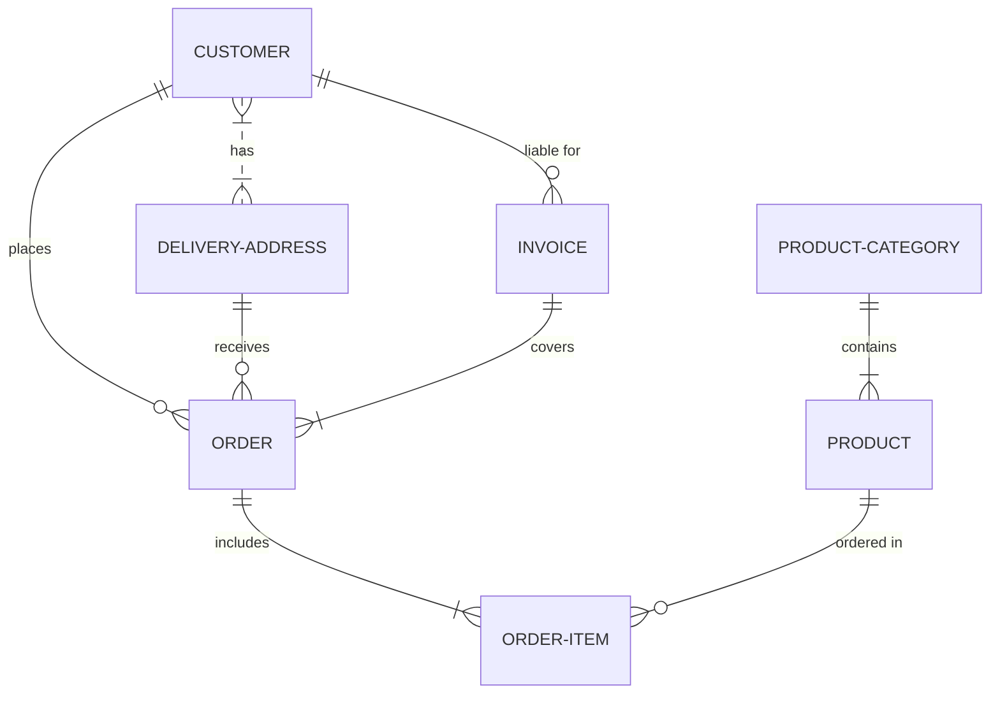
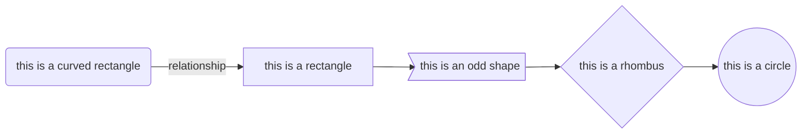

[mermaid cheatsheet](https://jojozhuang.github.io/tutorial/mermaid-cheat-sheet/)

This is an example of me trying to render a markdown diagram.

# Diagram number 2: experimenting with Mermaid "graphs"

